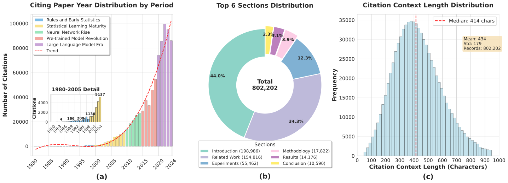
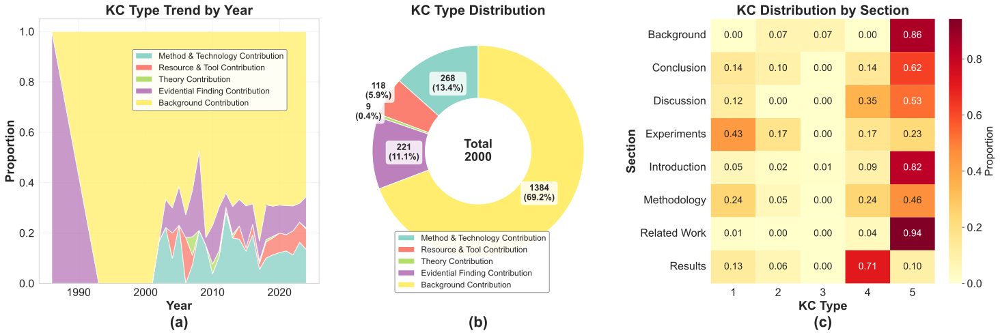

# Scientific Knowledge Contribution (SKC) Dataset

## 📖 Overview

The exponential growth of scientific literature has reshaped the contemporary research landscape, creating an urgent need for novel computational methods to enable knowledge navigation and theory construction. With annual academic output exceeding 2.5 million papers, traditional bibliometric analyses struggle to capture the multidimensional knowledge contributions that emerging research makes to scientific progress.

This dataset proposes a methodological shift from subjective citation intent analysis to objective knowledge contribution identification—moving from exploring "why authors cite" to identifying "what knowledge the cited work contributes." We have curated a high-quality knowledge contribution classification dataset containing 2,000 annotated samples from 802,202 citation instances collected from the ACL Anthology.

## 🎯 Research Motivation

Traditional function-oriented citation classification faces fundamental limitations:
- **Subjectivity Issues**: Focus on authors' subjective motivations rather than objective contributions of cited works
- **Decontextualization Problems**: Disconnect from real citation contexts
- **Scale Limitations**: Mainstream datasets (e.g., ACL-ARC, SciCite) are too small
- **Insufficient Granularity**: Lack of fine-grained contribution type categorization

## 📊 SKC Classification Framework

Our proposed Scientific Knowledge Contribution (SKC) classification framework systematically divides citation contributions into five major categories:

| Category | Description | Example |
|----------|-------------|---------|
| **Method Technology** | Citation where the citing paper directly uses, implements, improves, or extends methods, techniques, algorithms, models, systems, parsers, or evaluation metrics from the cited paper. Must be used by "we" (the authors). | "We adopt the BERT model [CITATION] as our encoder" |
| **Resource Tool** | Citation where the citing paper uses datasets, corpora, or explicitly labeled toolkits/toolboxes created by the cited paper. Must be directly used by "we" (the authors). | "We first extracted texts from DeReKo corpus [CITATION]" |
| **Theory** | Citation where the citing paper adopts theoretical concepts, definitions, frameworks, or paradigms from the cited paper to build their theoretical foundation. Focuses on "what is" or "how to understand". | "We use the theoretical rules proposed by [CITATION] to help us better establish each category" |
| **Evidential Finding** | Citation providing specific, verifiable empirical findings (experimental results, performance data, observed phenomena) used for: 1) direct comparison, 2) justifying decisions, or 3) stating empirical facts. | "[CITATION] showed RNNs fail on long sequences, so we use Transformers" |
| **Background** | Citation providing necessary understanding foundation or positioning research within the field through: 1) developmental course (vertical timeline) or 2) research landscape (horizontal snapshot). | "Multimodal sentiment analysis has become a research hotspot [CITATION1] [CITATION2][CITATION3]" |

## 🔧 Dataset Construction

### Data Source
- **Corpus**: ACL Anthology (1980-2024)
- **Raw Citations**: 802,202 instances
- **Annotated Samples**: 2,000 high-quality instances
- **Languages**: Primarily English academic papers

### Annotation Process
1. **Expert Annotation**: Domain experts with NLP background
2. **Quality Control**: Multi-round validation and consistency checks
3. **Inter-annotator Agreement**: Cohen's κ > 0.75
4. **Guideline Development**: Comprehensive annotation guidelines

## 📈 Dataset Analysis

### Citation Collection Overview (802,202 instances)

  
  
<em>Figure 1: Comprehensive analysis of 802,202 citation instances from ACL Anthology</em>

#### Temporal Distribution (1980-2024)
Our dataset spans **45 years** of computational linguistics research, capturing key developmental phases:
- **Period 1 (1980-1999)**: Rule-based and Early Statistical Learning Era
- **Period 2 (2000-2010)**: Statistical Learning Maturity Period  
- **Period 3 (2011-2016)**: Neural Network Rise and Deep Learning Revolution
- **Period 4 (2017-2020)**: Pre-trained Model Revolution Era
- **Period 5 (2021-2024)**: Large Language Model and Foundation Model Era

#### Section-wise Distribution
Citations are distributed across six primary paper sections:
- **Related Work**: 44.0% (154,816 instances) - Largest category
- **Introduction**: 34.3% (198,986 instances) - Second largest
- **Experiments**: 12.3% (55,462 instances)
- **Methodology**: 3.9% (17,822 instances)
- **Results**: 2.3% (14,176 instances)
- **Conclusion**: 2.3% (10,590 instances)

#### Citation Context Characteristics
- **Median Length**: 414 characters
- **Mean Length**: 434 characters (σ = 179)
- **Distribution**: Normal distribution with most contexts ranging 200-600 characters
- **Coverage**: Rich contextual information for semantic analysis

### Knowledge Contribution Annotation Results (2,000 samples)

  
  
<em>Figure 2: Analysis of 2,000 manually annotated samples using stratified sampling</em>

#### Sampling Strategy
We employed **stratified sampling** from the 802,202 citation pool to ensure representative coverage across different paper sections, years, and citation contexts.

#### SKC Type Distribution
The annotated dataset reveals the following knowledge contribution patterns:

| SKC Type | Count | Percentage | Description |
|----------|-------|------------|-------------|
| **Method & Technology** | 1,384 | 69.2% | Dominant contribution type |
| **Theory** | 268 | 13.4% | Conceptual frameworks |
| **Resource & Tool** | 221 | 11.1% | Datasets and tools |
| **Evidential Finding** | 118 | 5.9% | Empirical results |
| **Background** | 9 | 0.4% | Contextual information |

#### Temporal Trends (1990-2020)
- **Method & Technology Contribution**: Maintains consistent dominance across decades
- **Resource & Tool Contribution**: Shows growth after 2000
- **Theory Contribution**: Remains stable with moderate representation
- **Evidential Finding**: Increasing trend in recent years
- **Background Contribution**: Consistently minimal across all periods

#### Section-wise SKC Distribution
Heat map analysis reveals distinct patterns:
- **Related Work**: Predominantly Background contributions (94%)
- **Results**: Primarily Method & Technology contributions (71%)
- **Introduction**: Mainly Background contributions (86%)
- **Methodology**: Balanced distribution with Method emphasis (46%)
- **Experiments**: Method & Technology focused (43%)

## 🔍 Key Dataset Features

1. **Large-scale Foundation**: Built from 800K+ citation instances
2. **Temporal Comprehensiveness**: 45-year span covering major NLP evolution phases
3. **Balanced Sampling**: Stratified approach ensuring representativeness
4. **Fine-grained Classification**: 5 distinct knowledge contribution types
5. **Rich Context**: Average 400+ character citation contexts
6. **High Quality**: Expert annotation with rigorous quality control
7. **Research Relevance**: Addresses real challenges in citation analysis
## 📋 Data Format Description

### Dataset Structure
The dataset is provided in TSV (Tab-Separated Values) format, where each row represents a citation instance with the following fields:

| Field Name | Type | Description |
|------------|------|-------------|
| `id` | Integer | Unique identifier for the citation instance |
| `citing_paper_id` | String | Unique ID of the citing paper |
| `citing_paper_title` | String | Title of the citing paper |
| `citing_paper_authors` | String | Author list of the citing paper (semicolon-separated) |
| `citing_paper_year` | Integer | Publication year of the citing paper |
| `citing_paper_abstract` | String | Abstract of the citing paper |
| `citation_section` | String | Paper section where the citation appears |
| `citation_frequency` | Integer | Frequency of this citation in the citing paper |
| `cited_paper_title` | String | Title of the cited paper |
| `cited_paper_authors` | String | Author list of the cited paper (semicolon-separated) |
| `cited_paper_year` | Integer | Publication year of the cited paper |
| `cited_paper_bib_id` | String | Bibliography ID of the cited paper |
| `cited_paper_abstract` | String | Abstract of the cited paper |
| `citation_context` | String | Complete citation context (including surrounding sentences) |
| `prev_sentence` | String | Sentence preceding the citation |
| `current_sentence` | String | Current sentence containing the citation |
| `next_sentence` | String | Sentence following the citation |
| `period` | String | Time period identifier (e.g., Period5_2021-2024) |
| `KC` | Integer | Knowledge Contribution type label (1-5 mapping to SKC types) |

### Label Mapping
The Knowledge Contribution (KC) field uses numerical mapping:
- `1`: **Background** - Contextual information and research positioning
- `2`: **Method & Technology** - Algorithms, models, techniques, and systems
- `3`: **Resource & Tool** - Datasets, corpora, and computational tools
- `4`: **Theory** - Theoretical frameworks, concepts, and definitions
- `5`: **Evidential Finding** - Empirical results and experimental findings

### Data Sample

| Field | Value |
|-------|-------|
| **id** | 941749 |
| **citing_paper_id** | 2023.emnlp-main.873 |
| **citing_paper_title** | Hi Guys or Hi Folks? Benchmarking Gender-Neutral Machine Translation with the GeNTE Corpus |
| **citing_paper_authors** | Andrea Piergentili; Beatrice Savoldi; Dennis Fucci; Matteo Negri; Luisa Bentivogli |
| **citing_paper_year** | 2023 |
| **citing_paper_abstract** | Gender inequality is embedded in our communication practices and perpetuated in translation technologies. This becomes particularly apparent when translating into grammatical gender languages, where machine translation (MT) often defaults to masculine and stereotypical representations by making undue binary gender assumptions. Our work addresses the rising demand for inclusive language by focusing head-on on gender-neutral translation from English to Italian. We start from the essentials: proposing a dedicated benchmark and exploring automated evaluation methods. First, we introduce GeNTE, a natural, bilingual test set for gender-neutral translation, whose creation was informed by a survey on the perception and use of neutral language. Based on GeNTE, we then overview existing reference-based evaluation approaches, highlight their limits, and propose a reference-free method more suitable to assess gender-neutral translation. |
| **citation_section** | C.2 Training Setup |
| **citation_frequency** | 1 |
| **cited_paper_title** | Transformers: State-of-the-art natural language processing |
| **cited_paper_authors** | Thomas Wolf; Lysandre Debut; Victor Sanh; Julien Chaumond; Clement Delangue; Anthony Moi; Pierric Cistac; Tim Rault |
| **cited_paper_year** | 2020 |
| **cited_paper_bib_id** | wolf-etal-2020-transformers |
| **cited_paper_abstract** | Recent progress in natural language processing has been driven by advances in both model architecture and model pretraining.Transformer architectures have facilitated building higher-capacity models and pretraining has made it possible to effectively utilize this capacity for a wide variety of tasks.Transformers is an open-source library with the goal of opening up these advances to the wider machine learning community.The library consists of carefully engineered stateof-the art Transformer architectures under a unified API.Backing this library is a curated collection of pretrained models made by and available for the community.Transformers is designed to be extensible by researchers, simple for practitioners, and fast and robust in industrial deployments.The library is available at https://github.com/ huggingface/transformers. |
| **citation_context** | We trained the parameters of both the linear layer and UmBERTo on the classification task for 2 epoch, with learning rate of 5e-5, batch size of 64 and maximum sequence length of 64, on a p3.2xlarge instance on AWS (featuring one NVIDIA V100 GPU). The code for finetuning relies on Huggingface transformers library CITATION . |
| **prev_sentence** | We trained the parameters of both the linear layer and UmBERTo on the classification task for 2 epoch, with learning rate of 5e-5, batch size of 64 and maximum sequence length of 64, on a p3.2xlarge instance on AWS (featuring one NVIDIA V100 GPU). |
| **current_sentence** | The code for finetuning relies on Huggingface transformers library CITATION . |
| **next_sentence** | (empty) |
| **period** | Period5_2021-2024 |
| **KC** | 2 |

